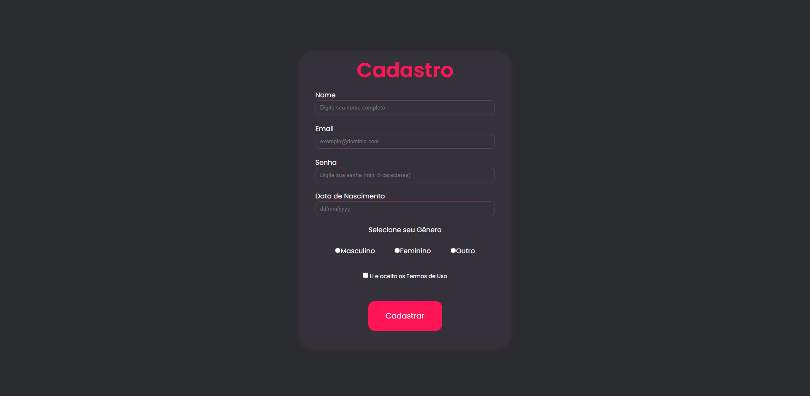

# Projeto de Página de Cadastro

Este projeto consiste em uma simples página de cadastro criada com HTML e CSS, com o objetivo de treinar minhas habilidades.

## Visão Geral

A página de cadastro inclui campos para entrada de dados como nome, e-mail e senha.

## Tecnologias Utilizadas

- HTML5
- CSS3

## Visualização



## Como Executar o Projeto

1. Clone o repositório:
   ```bash
   git clone https://github.com/usuario/nome-do-repositorio.git
   ```
2. Navegue até a pasta do projeto:
   ```bash
   cd nome-do-repositorio
   ```
3. Abra o arquivo `index.html` em seu navegador de preferência.

## Futuras Implementações

- Área de login
- Adição de responsividade para outros dispositivos